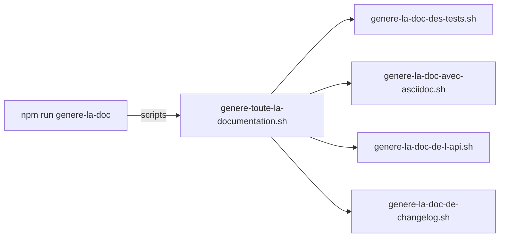

# Living Documentation

Projet de test sur la génération de documentation à partir du code.

## Utilisation du projet

### Prérequis
Pour faire fonctionner ce projet, vous avez besoin de :
- Linux
- Java 11 minimum
- Maven
- [NPM](https://docs.npmjs.com/downloading-and-installing-node-js-and-npm)
  - Une fois NPM installé, ne pas oublier de lancer la commande `npm install` à la racine du projet.
- Firefox

**NB :** Pour installer Java et Maven vous pouvez utiliser [SDKMan](https://sdkman.io/).

### Exécution des commandes

- `npm run nettoie` => Supprime tous les répertoires de génération (exécutables ou documentation).
- `npm run construit` => `nettoie` et crée les exécutables.
- `npm run lance-dev` => Compile et lance l'application SpringBoot.
- `npm run genere-la-doc` => Génère la documentation complète du projet.

Pour générer la documentation du projet, il suffit de lancer la commande `npm run genere-la-doc`.

L'ensemble des documents générés est accessible via la page d'index ouverte dans firefox depuis cette adresse : "target/generated-docs/index.html"

### Utilisation des profils Maven

Plusieurs profils Maven ont été définis pour résoudre les problèmes de conflit entre les dépendances.
Ces profils peuvent utilisés séparément pour des besoins de test. 
Certains nécessitent simplement la création du dossier `target/generated-docs/`.

La commande `npm run genere-la-doc` permet de tous les lancer au travers de plusieurs scripts qui s'enchaînent.

## L'application de support

Il s'agit d'une application de gestion d'une collection de Comics. Elle est conçue en DDD.  
L'application n'est pas fonctionnelle. Il manque des ressources REST, de la persistance... Néanmoins il y a suffisamment de code pour tester les différents outils de génération de documentation ci-dessous.  

L'application comprend un seul domaine et 3 "bounded context" :  

- Le référentiel des comics existants.  
- La collection des comics possédés par l'utilisateur.  
- La liste des comics manquants.  

La liste d'achat (comics manquants) est générée par delta entre les séries définies dans le référentiel et la liste des comics déjà acquis par l'utilisateur.

L'application est couverte par des tests unitaires et utilise l'architecture hexagonale pour chacun de ses contextes bornés.

## Génération de la documentation

Tous les outils testés (cf. chapitre ci-dessous) génèrent leurs docs dans le répertoire `target/generated-docs`. 
Ils sont tous référencés dans la page `index.html`.

## Notes et commentaires sur les outils testés

Les commentaires associés sont dans des fiches séparées dans le dossier `src/doc/notes-utilisation-outils`.
Fonctionnement :
- Une fiche au format Markdown par outil testé
- Pour créer une nouvelle fiche :
  - Copier le fichier `src/doc/template/notes-utilisation-outils.md` dans le dossier `notes-utilisation-outils`
  - Renommer le fichier en  _nom_de_l_outil_.md
  - Modifier le nom de l'outil sur la première ligne
  - Finir de remplir la fiche
- Toutes les fiches seront prises en compte au moment de la génération de la doc
- Le contenu généré à partir des fiches sera disponible dans la page `target/generated-docs/index.html`.
